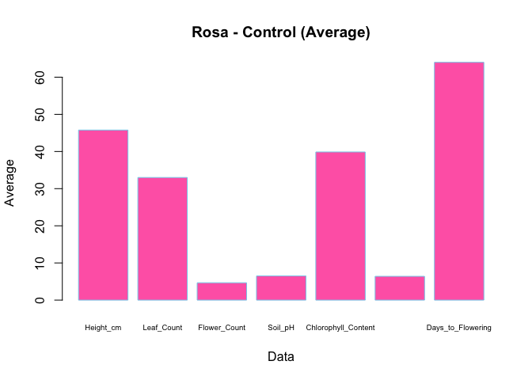
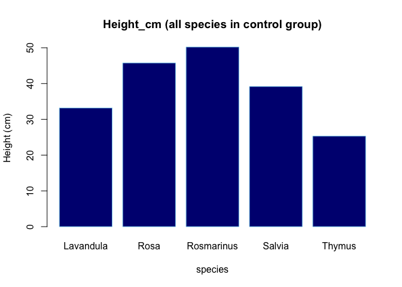
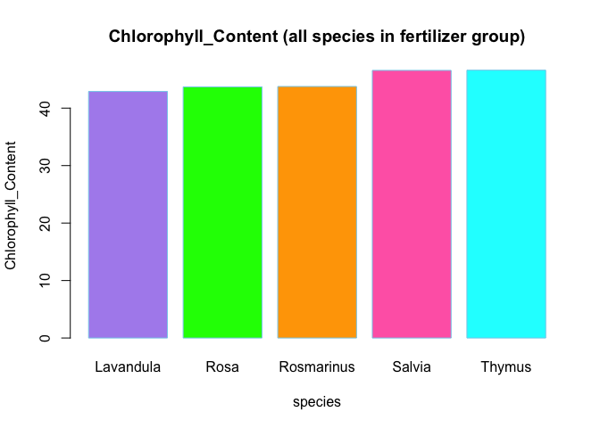
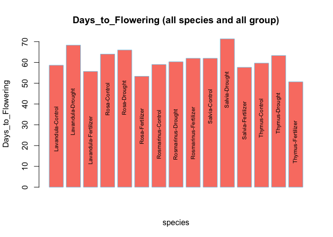

665020082-6_NT_basicR
================
Nanthanit
2025-05-04

``` r
#นำเข้าไฟล์ csv
plant_growth_data <- read.csv("plant_growth_data.csv")
head(plant_growth_data)
```

    ##   Plant_ID Species  Treatment Height_cm Leaf_Count Flower_Count Soil_pH
    ## 1        1    Rosa    Control      43.3         29            5     6.7
    ## 2        2    Rosa    Control      44.3         33            5     6.2
    ## 3        3    Rosa    Control      49.7         37            4     6.6
    ## 4        4    Rosa Fertilizer      53.2         46            6     7.2
    ## 5        5    Rosa Fertilizer      53.4         42            9     6.5
    ## 6        6    Rosa Fertilizer      58.1         48            6     6.9
    ##   Chlorophyll_Content Stem_Diameter Days_to_Flowering
    ## 1                36.8           6.6                64
    ## 2                43.8           5.9                65
    ## 3                39.0           6.7                63
    ## 4                42.4           8.9                48
    ## 5                44.3           7.0                59
    ## 6                44.4          10.7                53

``` r
#เปิดใช้งานแพ็คเกจ
library(dplyr) 
```

    ## 
    ## Attaching package: 'dplyr'

    ## The following objects are masked from 'package:stats':
    ## 
    ##     filter, lag

    ## The following objects are masked from 'package:base':
    ## 
    ##     intersect, setdiff, setequal, union

``` r
library(ggplot2)
```

\#ข้อ 1 หาค่าเฉลี่ยของ Height_cm, Leaf_Count, Flower_Count, Soil_pH,
Chlorophyll_Content, Stem_Diameter และ Days_to_Flowering สำหรับแต่ละ
Species และ Treatment

``` r
#หาค่าเฉลี่ยใน Rosa sp.
#เลือกข้อมูลเฉพาะ Rosa และสร้าง data frame ใหม่ชื่อ df_Rosa
df_Rosa <- filter(plant_growth_data, Species == "Rosa")
df_Rosa
```

    ##   Plant_ID Species  Treatment Height_cm Leaf_Count Flower_Count Soil_pH
    ## 1        1    Rosa    Control      43.3         29            5     6.7
    ## 2        2    Rosa    Control      44.3         33            5     6.2
    ## 3        3    Rosa    Control      49.7         37            4     6.6
    ## 4        4    Rosa Fertilizer      53.2         46            6     7.2
    ## 5        5    Rosa Fertilizer      53.4         42            9     6.5
    ## 6        6    Rosa Fertilizer      58.1         48            6     6.9
    ## 7        7    Rosa    Drought      39.4         31            5     6.3
    ## 8        8    Rosa    Drought      34.2         27            4     6.1
    ## 9        9    Rosa    Drought      35.9         36            2     6.1
    ##   Chlorophyll_Content Stem_Diameter Days_to_Flowering
    ## 1                36.8           6.6                64
    ## 2                43.8           5.9                65
    ## 3                39.0           6.7                63
    ## 4                42.4           8.9                48
    ## 5                44.3           7.0                59
    ## 6                44.4          10.7                53
    ## 7                38.3           5.8                66
    ## 8                35.3           5.3                65
    ## 9                37.3           4.6                67

``` r
#หาค่าเฉลี่ยของทุกค่าในแต่ละ Treatment ของ Rosa sp.
result_Rosa <- df_Rosa  %>%
  group_by(Treatment) %>%
  summarise(
    Rosa_Height_cm_mean = mean(Height_cm),
    Rosa_Leaf_Count_mean = mean(Leaf_Count),
    Rosa_Flower_Count_mean = mean(Flower_Count),
    Rosa_Soil_pH_mean = mean(Soil_pH),
    Rosa_Chlorophyll_Content_mean = mean(Chlorophyll_Content),
    Rosa_Stem_Diameter_mean = mean(Stem_Diameter),
    Rosa_Days_to_Flowering_mean = mean(Days_to_Flowering)
  )
result_Rosa
```

    ## # A tibble: 3 × 8
    ##   Treatment  Rosa_Height_cm_mean Rosa_Leaf_Count_mean Rosa_Flower_Count_mean
    ##   <chr>                    <dbl>                <dbl>                  <dbl>
    ## 1 Control                   45.8                 33                     4.67
    ## 2 Drought                   36.5                 31.3                   3.67
    ## 3 Fertilizer                54.9                 45.3                   7   
    ## # ℹ 4 more variables: Rosa_Soil_pH_mean <dbl>,
    ## #   Rosa_Chlorophyll_Content_mean <dbl>, Rosa_Stem_Diameter_mean <dbl>,
    ## #   Rosa_Days_to_Flowering_mean <dbl>

``` r
#หาค่าเฉลี่ยใน Lavandula sp.
#เลือกข้อมูลเฉพาะ Lavandula และสร้าง data frame ใหม่ชื่อ df_Lavandula
df_Lavandula <- filter(plant_growth_data, Species == "Lavandula")
df_Lavandula
```

    ##   Plant_ID   Species  Treatment Height_cm Leaf_Count Flower_Count Soil_pH
    ## 1       10 Lavandula    Control      30.7         23            8     6.2
    ## 2       11 Lavandula    Control      35.7         36            9     6.4
    ## 3       12 Lavandula    Control      33.1         19           10     6.2
    ## 4       13 Lavandula Fertilizer      41.2         36           13     6.9
    ## 5       14 Lavandula Fertilizer      40.3         33           12     7.2
    ## 6       15 Lavandula Fertilizer      38.3         32           12     6.5
    ## 7       16 Lavandula    Drought      30.4         26            8     6.6
    ## 8       17 Lavandula    Drought      26.5         19            7     6.6
    ## 9       18 Lavandula    Drought      19.1         14            5     6.5
    ##   Chlorophyll_Content Stem_Diameter Days_to_Flowering
    ## 1                38.5           4.0                60
    ## 2                40.6           4.0                52
    ## 3                39.0           4.8                64
    ## 4                45.3           6.6                57
    ## 5                42.3           6.4                54
    ## 6                41.1           5.0                56
    ## 7                41.0           3.8                66
    ## 8                36.8           3.5                66
    ## 9                31.2           4.4                73

``` r
#หาค่าเฉลี่ยของทุกค่าในแต่ละ Treatment ของ Lavandula sp.
result_Lavandula <- df_Lavandula  %>%
  group_by(Treatment) %>%
  summarise(
    Lavandula_Height_cm_mean = mean(Height_cm),
    Lavandula_Leaf_Count_mean = mean(Leaf_Count),
    Lavandula_Flower_Count_mean = mean(Flower_Count),
    Lavandula_Soil_pH_mean = mean(Soil_pH),
    Lavandula_Chlorophyll_Content_mean = mean(Chlorophyll_Content),
    Lavandula_Stem_Diameter_mean = mean(Stem_Diameter),
    Lavandula_Days_to_Flowering_mean = mean(Days_to_Flowering)
  )
result_Lavandula
```

    ## # A tibble: 3 × 8
    ##   Treatment Lavandula_Height_cm_…¹ Lavandula_Leaf_Count…² Lavandula_Flower_Cou…³
    ##   <chr>                      <dbl>                  <dbl>                  <dbl>
    ## 1 Control                     33.2                   26                     9   
    ## 2 Drought                     25.3                   19.7                   6.67
    ## 3 Fertiliz…                   39.9                   33.7                  12.3 
    ## # ℹ abbreviated names: ¹​Lavandula_Height_cm_mean, ²​Lavandula_Leaf_Count_mean,
    ## #   ³​Lavandula_Flower_Count_mean
    ## # ℹ 4 more variables: Lavandula_Soil_pH_mean <dbl>,
    ## #   Lavandula_Chlorophyll_Content_mean <dbl>,
    ## #   Lavandula_Stem_Diameter_mean <dbl>, Lavandula_Days_to_Flowering_mean <dbl>

``` r
#หาค่าเฉลี่ยใน Salvia sp.
#เลือกข้อมูลเฉพาะ Salvia และสร้าง data frame ใหม่ชื่อ df_Salvia
df_Salvia <- filter(plant_growth_data, Species == "Salvia")
df_Salvia
```

    ##   Plant_ID Species  Treatment Height_cm Leaf_Count Flower_Count Soil_pH
    ## 1       19  Salvia    Control      42.1         29            7     6.3
    ## 2       20  Salvia    Control      38.6         26            9     6.5
    ## 3       21  Salvia    Control      36.8         31            7     6.4
    ## 4       22  Salvia Fertilizer      47.3         40           12     6.9
    ## 5       23  Salvia Fertilizer      44.9         36            9     6.7
    ## 6       24  Salvia Fertilizer      45.8         41           11     7.0
    ## 7       25  Salvia    Drought      31.1         35            7     6.3
    ## 8       26  Salvia    Drought      27.9         20            6     6.6
    ## 9       27  Salvia    Drought      35.5         17            6     6.2
    ##   Chlorophyll_Content Stem_Diameter Days_to_Flowering
    ## 1                38.2           5.2                59
    ## 2                36.4           5.6                61
    ## 3                46.6           7.4                66
    ## 4                48.9           7.0                60
    ## 5                44.2           5.4                61
    ## 6                46.6           6.2                52
    ## 7                33.8           5.2                75
    ## 8                33.6           3.8                65
    ## 9                32.6           4.8                74

``` r
#หาค่าเฉลี่ยของทุกค่าในแต่ละ Treatment ของ Salvia sp.
result_Salvia<- df_Salvia  %>%
  group_by(Treatment) %>%
  summarise(
    Salvia_Height_cm_mean = mean(Height_cm),
    Salvia_Leaf_Count_mean = mean(Leaf_Count),
    Salvia_Flower_Count_mean = mean(Flower_Count),
    Salvia_Soil_pH_mean = mean(Soil_pH),
    Salvia_Chlorophyll_Content_mean = mean(Chlorophyll_Content),
    Salvia_Stem_Diameter_mean = mean(Stem_Diameter),
    Salvia_Days_to_Flowering_mean = mean(Days_to_Flowering)
  )
result_Salvia
```

    ## # A tibble: 3 × 8
    ##   Treatment  Salvia_Height_cm_mean Salvia_Leaf_Count_mean Salvia_Flower_Count_…¹
    ##   <chr>                      <dbl>                  <dbl>                  <dbl>
    ## 1 Control                     39.2                   28.7                   7.67
    ## 2 Drought                     31.5                   24                     6.33
    ## 3 Fertilizer                  46                     39                    10.7 
    ## # ℹ abbreviated name: ¹​Salvia_Flower_Count_mean
    ## # ℹ 4 more variables: Salvia_Soil_pH_mean <dbl>,
    ## #   Salvia_Chlorophyll_Content_mean <dbl>, Salvia_Stem_Diameter_mean <dbl>,
    ## #   Salvia_Days_to_Flowering_mean <dbl>

``` r
#หาค่าเฉลี่ยใน Thymus sp.
#เลือกข้อมูลเฉพาะ Thymus และสร้าง data frame ใหม่ชื่อ df_Thymus
df_Thymus <- filter(plant_growth_data, Species == "Thymus")
df_Thymus
```

    ##   Plant_ID Species  Treatment Height_cm Leaf_Count Flower_Count Soil_pH
    ## 1       28  Thymus    Control      25.5         25           14     6.2
    ## 2       29  Thymus    Control      21.6         14           14     7.1
    ## 3       30  Thymus    Control      28.8         20           13     6.4
    ## 4       31  Thymus Fertilizer      34.3         33           18     6.9
    ## 5       32  Thymus Fertilizer      32.1         24           17     6.9
    ## 6       33  Thymus Fertilizer      35.7         22           17     6.7
    ## 7       34  Thymus    Drought      20.6         17           13     6.5
    ## 8       35  Thymus    Drought      20.5         16           16     6.5
    ## 9       36  Thymus    Drought      20.1         16           12     6.4
    ##   Chlorophyll_Content Stem_Diameter Days_to_Flowering
    ## 1                38.2           3.5                53
    ## 2                45.0           3.3                60
    ## 3                39.8           5.9                66
    ## 4                45.4           5.1                51
    ## 5                45.7           5.9                51
    ## 6                48.7           6.0                50
    ## 7                33.5           3.0                60
    ## 8                32.0           1.5                63
    ## 9                40.0           2.5                67

``` r
#หาค่าเฉลี่ยของทุกค่าในแต่ละ Treatment ของ Thymus sp.
result_Thymus<- df_Thymus  %>%
  group_by(Treatment) %>%
  summarise(
    Thymus_Height_cm_mean = mean(Height_cm),
    Thymus_Leaf_Count_mean = mean(Leaf_Count),
    Thymus_Flower_Count_mean = mean(Flower_Count),
    Thymus_Soil_pH_mean = mean(Soil_pH),
    Thymus_Chlorophyll_Content_mean = mean(Chlorophyll_Content),
    Thymus_Stem_Diameter_mean = mean(Stem_Diameter),
    Thymus_Days_to_Flowering_mean = mean(Days_to_Flowering)
  )
result_Thymus
```

    ## # A tibble: 3 × 8
    ##   Treatment  Thymus_Height_cm_mean Thymus_Leaf_Count_mean Thymus_Flower_Count_…¹
    ##   <chr>                      <dbl>                  <dbl>                  <dbl>
    ## 1 Control                     25.3                   19.7                   13.7
    ## 2 Drought                     20.4                   16.3                   13.7
    ## 3 Fertilizer                  34.0                   26.3                   17.3
    ## # ℹ abbreviated name: ¹​Thymus_Flower_Count_mean
    ## # ℹ 4 more variables: Thymus_Soil_pH_mean <dbl>,
    ## #   Thymus_Chlorophyll_Content_mean <dbl>, Thymus_Stem_Diameter_mean <dbl>,
    ## #   Thymus_Days_to_Flowering_mean <dbl>

``` r
#หาค่าเฉลี่ยใน Rosmarinus sp.
#เลือกข้อมูลเฉพาะ Rosmarinus และสร้าง data frame ใหม่ชื่อ df_Rosmarinus
df_Rosmarinus <- filter(plant_growth_data, Species == "Rosmarinus")
df_Rosmarinus
```

    ##   Plant_ID    Species  Treatment Height_cm Leaf_Count Flower_Count Soil_pH
    ## 1       37 Rosmarinus    Control      51.7         43            6     6.5
    ## 2       38 Rosmarinus    Control      49.8         38            6     6.5
    ## 3       39 Rosmarinus    Control      49.1         43            5     6.9
    ## 4       40 Rosmarinus Fertilizer      56.9         44            9     6.7
    ## 5       41 Rosmarinus Fertilizer      55.9         46           11     6.6
    ## 6       42 Rosmarinus Fertilizer      57.4         51           10     6.8
    ## 7       43 Rosmarinus    Drought      39.2         34            4     6.5
    ## 8       44 Rosmarinus    Drought      49.5         38            3     6.5
    ## 9       45 Rosmarinus    Drought      46.6         43            1     6.3
    ##   Chlorophyll_Content Stem_Diameter Days_to_Flowering
    ## 1                38.7           7.3                50
    ## 2                37.8           7.5                61
    ## 3                36.3           8.7                66
    ## 4                41.1          10.8                65
    ## 5                43.3           9.9                62
    ## 6                46.9           8.5                59
    ## 7                38.3           4.1                56
    ## 8                37.1           7.0                62
    ## 9                33.9           7.1                63

``` r
#หาค่าเฉลี่ยของทุกค่าในแต่ละ Treatment ของ  Rosmarinus sp. 
result_Rosmarinus<- df_Rosmarinus  %>%
  group_by(Treatment) %>%
  summarise(
    Rosmarinus_Height_cm_mean = mean(Height_cm),
    Rosmarinus_Leaf_Count_mean = mean(Leaf_Count),
    Rosmarinus_Flower_Count_mean = mean(Flower_Count),
    Rosmarinus_Soil_pH_mean = mean(Soil_pH),
    Rosmarinus_Chlorophyll_Content_mean = mean(Chlorophyll_Content),
    Rosmarinus_Stem_Diameter_mean = mean(Stem_Diameter),
    Rosmarinus_Days_to_Flowering_mean = mean(Days_to_Flowering)
  )
result_Rosmarinus
```

    ## # A tibble: 3 × 8
    ##   Treatment Rosmarinus_Height_cm…¹ Rosmarinus_Leaf_Coun…² Rosmarinus_Flower_Co…³
    ##   <chr>                      <dbl>                  <dbl>                  <dbl>
    ## 1 Control                     50.2                   41.3                   5.67
    ## 2 Drought                     45.1                   38.3                   2.67
    ## 3 Fertiliz…                   56.7                   47                    10   
    ## # ℹ abbreviated names: ¹​Rosmarinus_Height_cm_mean, ²​Rosmarinus_Leaf_Count_mean,
    ## #   ³​Rosmarinus_Flower_Count_mean
    ## # ℹ 4 more variables: Rosmarinus_Soil_pH_mean <dbl>,
    ## #   Rosmarinus_Chlorophyll_Content_mean <dbl>,
    ## #   Rosmarinus_Stem_Diameter_mean <dbl>,
    ## #   Rosmarinus_Days_to_Flowering_mean <dbl>

\#ข้อ 2 สร้าง data frame ใหม่ที่ประกอบด้วย Species, Treatment
และค่าเฉลี่ยของพารามิเตอร์แต่ละตัว ใช้ head() เพื่อแสดง data frame ใหม่ของคุณ

``` r
#สร้างตารางรวมค่าเฉลี่ย
summary_df <- plant_growth_data %>%
  group_by(Species, Treatment) %>%
  summarise(
    across(
      c(Height_cm, Leaf_Count, Flower_Count, Soil_pH,
        Chlorophyll_Content, Stem_Diameter, Days_to_Flowering),
      \(x) mean(x, na.rm = TRUE)
    ),
    .groups = "drop"
  )
head(summary_df)
```

    ## # A tibble: 6 × 9
    ##   Species   Treatment  Height_cm Leaf_Count Flower_Count Soil_pH
    ##   <chr>     <chr>          <dbl>      <dbl>        <dbl>   <dbl>
    ## 1 Lavandula Control         33.2       26           9       6.27
    ## 2 Lavandula Drought         25.3       19.7         6.67    6.57
    ## 3 Lavandula Fertilizer      39.9       33.7        12.3     6.87
    ## 4 Rosa      Control         45.8       33           4.67    6.5 
    ## 5 Rosa      Drought         36.5       31.3         3.67    6.17
    ## 6 Rosa      Fertilizer      54.9       45.3         7       6.87
    ## # ℹ 3 more variables: Chlorophyll_Content <dbl>, Stem_Diameter <dbl>,
    ## #   Days_to_Flowering <dbl>

\#ข้อ 3 พล็อตกราฟแท่งของ Height_cm, Leaf_Count, Flower_Count, Soil_pH,
Chlorophyll_Content, Stem_Diameter และ Days_to_Flowering ใน Rosa/Control
(ใช้ค่าเฉลี่ยของแต่ละการวัด)

``` r
barplot(as.numeric(summary_df[4,3:9]), #ดึงค่าตัวเลขแถวที่ 4 คอลัมน์ที่ 3–9 แล้วแปลงเป็นเวกเตอร์
        names.arg = names(summary_df[3:9]),
        main = "Rosa - Control (Average)",
        xlab = "Data",
        ylab = "Average",
        col = 'hotpink',
        border = "skyblue",
        cex.names = 0.6
        )
```

<!-- -->
\#ข้อ 4เปรียบเทียบค่าเฉลี่ยของ Height_cm ระหว่าง Species ในกลุ่ม control
โดยใช้กราฟแท่ง

``` r
all_control.df <- filter(summary_df, Treatment == "Control")
all_control.df
```

    ## # A tibble: 5 × 9
    ##   Species    Treatment Height_cm Leaf_Count Flower_Count Soil_pH
    ##   <chr>      <chr>         <dbl>      <dbl>        <dbl>   <dbl>
    ## 1 Lavandula  Control        33.2       26           9       6.27
    ## 2 Rosa       Control        45.8       33           4.67    6.5 
    ## 3 Rosmarinus Control        50.2       41.3         5.67    6.63
    ## 4 Salvia     Control        39.2       28.7         7.67    6.4 
    ## 5 Thymus     Control        25.3       19.7        13.7     6.57
    ## # ℹ 3 more variables: Chlorophyll_Content <dbl>, Stem_Diameter <dbl>,
    ## #   Days_to_Flowering <dbl>

``` r
barplot(all_control.df$Height_cm,
        names.arg = all_control.df$Species,
        main = "Height_cm (all species in control group)",
        xlab = "species",
        ylab = "Height (cm)",
        col = "navy",
        border = "skyblue"
        )
```

<!-- -->
\#ข้อ 5เปรียบเทียบค่าเฉลี่ยของ Chlorophyll_Content ระหว่าง Species ในกลุ่ม
fertilizer โดยใช้กราฟแท่ง

``` r
all_ferti.df <- filter(summary_df, Treatment == "Fertilizer")
all_ferti.df
```

    ## # A tibble: 5 × 9
    ##   Species    Treatment  Height_cm Leaf_Count Flower_Count Soil_pH
    ##   <chr>      <chr>          <dbl>      <dbl>        <dbl>   <dbl>
    ## 1 Lavandula  Fertilizer      39.9       33.7         12.3    6.87
    ## 2 Rosa       Fertilizer      54.9       45.3          7      6.87
    ## 3 Rosmarinus Fertilizer      56.7       47           10      6.7 
    ## 4 Salvia     Fertilizer      46         39           10.7    6.87
    ## 5 Thymus     Fertilizer      34.0       26.3         17.3    6.83
    ## # ℹ 3 more variables: Chlorophyll_Content <dbl>, Stem_Diameter <dbl>,
    ## #   Days_to_Flowering <dbl>

``` r
barplot(all_ferti.df$Chlorophyll_Content,
        names.arg = all_ferti.df$Species,
        main = "Chlorophyll_Content (all species in fertilizer group)",
        xlab = "species",
        ylab = "Chlorophyll_Content",
        col =c("#af8fee","green","orange","hotpink","cyan"),
        border = "skyblue"
        )
```

<!-- -->
\#ข้อ 6 เปรียบเทียบค่าเฉลี่ยของ Days_to_Flowering ของทุก Species และ Treatment
โดยใช้กราฟแท่ง

``` r
bp <- barplot(
  summary_df$Days_to_Flowering,
  names.arg = rep("", nrow(summary_df)), # ซ่อน names.arg
  main = "Days_to_Flowering (all species and all group)",
  xlab = "species",
  ylab = "Days_to_Flowering",
  col = "salmon",
  border = "skyblue"
)
# ชื่อของแต่ละแท่ง (จาก names.arg เดิม)
my_labels <- paste(summary_df$Species, summary_df$Treatment, sep = "-")
# ใส่ตัวหนังสือลงบนแท่ง (ตรงจุดสูงสุดของแต่ละแท่ง)
text(
  x = bp, 
  y = summary_df$Days_to_Flowering + 2, # +2 เพื่อให้ชื่ออยู่เหนือแท่ง
  labels = my_labels, 
  srt = 90,       # หมุนชื่อให้ตั้งตรง
  adj = 2,        # ชิดด้านล่างถ้าหมุน 90 องศา
  cex = 0.7,      # ขนาดตัวหนังสือ
  xpd = TRUE      # ให้พิมพ์เกินขอบกราฟได้ (ถ้าจำเป็น)
)
```

<!-- -->
